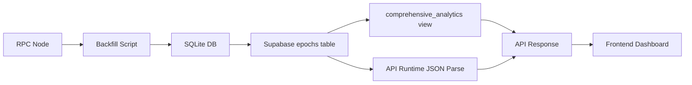
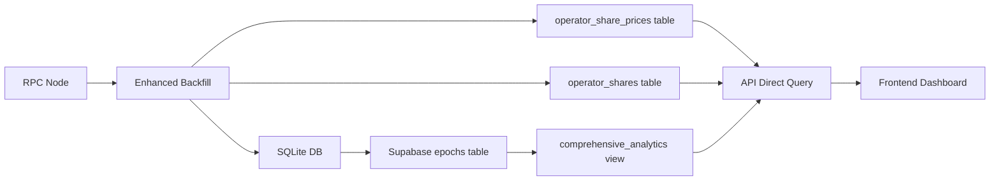

# Operator Share Price Database Migration Plan

## Executive Summary

This plan outlines the migration from JSON-based runtime extraction of operator share prices to a normalized database schema that supports performance, scalability, and maintainability requirements for handling 64+ operators.

## Current Architecture Analysis

### 1. Data Flow



### 2. Performance Bottlenecks

1. **API Layer**: `extractOperatorDataFromJSON()` function parses complex nested JSON at runtime
   - Lines 174-265 in `/api/epochs/route.ts`
   - Called for every epoch when `limit <= 300` or no sampling
   - Causes 10-30s latency for "All" range queries

2. **Database Layer**: `comprehensive_analytics` materialized view
   - Hardcoded columns for operators 0-3 only
   - Complex JSON extraction in SQL for share prices (lines 98-214 in `update_comprehensive_analytics.sql`)
   - Won't scale beyond 4 operators

3. **Data Volume**: 
   - Each epoch contains ~2-5KB of JSON data
   - With 5000+ epochs, full scans process 10-25MB of JSON

## Proposed Architecture

### 1. New Database Schema

#### A. Normalized Tables

```sql
-- Operator share prices per epoch (primary table)
CREATE TABLE operator_share_prices (
  epoch INTEGER NOT NULL,
  operator_id INTEGER NOT NULL,
  share_price_perq NUMERIC(40, 0) NOT NULL,  -- 1e18 scaled perquintill
  source TEXT NOT NULL DEFAULT 'epochs_json',
  inserted_at TIMESTAMP WITH TIME ZONE DEFAULT NOW(),
  PRIMARY KEY (epoch, operator_id)
);

CREATE INDEX idx_operator_share_prices_operator ON operator_share_prices(operator_id, epoch);
CREATE INDEX idx_operator_share_prices_epoch_brin ON operator_share_prices USING BRIN(epoch);

-- Operator shares raw (optional but recommended)
CREATE TABLE operator_shares (
  epoch INTEGER NOT NULL,
  operator_id INTEGER NOT NULL,
  shares_raw NUMERIC(40, 0) NOT NULL,
  inserted_at TIMESTAMP WITH TIME ZONE DEFAULT NOW(),
  PRIMARY KEY (epoch, operator_id)
);

CREATE INDEX idx_operator_shares_operator ON operator_shares(operator_id, epoch);

-- Operator metadata (future-proofing)
CREATE TABLE operators_metadata (
  operator_id INTEGER PRIMARY KEY,
  name TEXT,
  color TEXT,
  first_seen_epoch INTEGER,
  last_seen_epoch INTEGER,
  is_active BOOLEAN DEFAULT true,
  metadata JSONB,
  created_at TIMESTAMP WITH TIME ZONE DEFAULT NOW(),
  updated_at TIMESTAMP WITH TIME ZONE DEFAULT NOW()
);
```

#### B. Helper Functions (Required)

```sql
-- Parse comma-separated numbers from JSON
CREATE OR REPLACE FUNCTION parse_comma_number(text_val TEXT)
RETURNS NUMERIC AS $$
BEGIN
  IF text_val IS NULL THEN
    RETURN 0;
  END IF;
  RETURN REPLACE(text_val, ',', '')::NUMERIC;
EXCEPTION
  WHEN OTHERS THEN
    RETURN 0;
END;
$$ LANGUAGE plpgsql IMMUTABLE;

-- Convert hex strings to numeric
CREATE OR REPLACE FUNCTION hex_to_numeric(hex_val TEXT)
RETURNS NUMERIC AS $$
BEGIN
  IF hex_val IS NULL OR hex_val = '' THEN
    RETURN 0;
  END IF;
  -- Remove 0x prefix if present
  IF SUBSTRING(hex_val FROM 1 FOR 2) = '0x' THEN
    hex_val := SUBSTRING(hex_val FROM 3);
  END IF;
  -- Convert hex to decimal
  RETURN ('x' || hex_val)::bit(256)::bigint::numeric;
EXCEPTION
  WHEN OTHERS THEN
    RETURN 0;
END;
$$ LANGUAGE plpgsql IMMUTABLE;
```

### 2. Updated Data Flow



## Implementation Phases

### Phase 1: Database Schema Creation (Day 1)
- [ ] Create helper functions if not exists
- [ ] Create normalized tables
- [ ] Test with sample data
- [ ] Create migration rollback script

### Phase 2: Backfill Script Enhancement (Day 1-2)
- [ ] Update `optimized-comprehensive-backfill.mjs` to extract and store:
  - Operator share prices from `operatorEpochSharePrice.entries`
  - Operator shares from `operators.entries[].value.currentTotalShares`
- [ ] Add batch UPSERT logic for normalized tables
- [ ] Test with small epoch range (100 epochs)

### Phase 3: Historical Data Migration (Day 2-3)
- [ ] Run full historical backfill
- [ ] Validate data integrity
- [ ] Create data verification queries

### Phase 4: View Enhancement (Day 3)
- [ ] Update `comprehensive_analytics` to JOIN normalized tables
- [ ] Add backward-compatible columns for operators 0-3
- [ ] Test view performance

### Phase 5: API Refactoring (Day 4)
- [ ] Remove `extractOperatorDataFromJSON` function
- [ ] Update `/api/epochs` to query normalized tables
- [ ] Maintain backward compatibility with existing response format
- [ ] Add caching layer for frequently accessed data

### Phase 6: Testing & Validation (Day 5)
- [ ] Performance benchmarks (target: <2s for "All" queries)
- [ ] Data integrity validation
- [ ] Frontend integration testing
- [ ] Load testing with simulated 64 operators

### Phase 7: Production Deployment (Day 6)
- [ ] Deploy schema changes
- [ ] Run production backfill
- [ ] Monitor performance metrics
- [ ] Gradual API switchover

## Migration Scripts Overview

### 1. Schema Creation (`01_create_normalized_tables.sql`)
### 2. Backfill Enhancement (`update_backfill_script.mjs`)
### 3. View Update (`03_update_comprehensive_view.sql`)
### 4. API Refactor (`update_api_endpoints.ts`)
### 5. Verification Queries (`05_verify_migration.sql`)

## Performance Targets

| Metric | Current | Target | Improvement |
|--------|---------|--------|-------------|
| "All" epochs query | 10-30s | <2s | 15x |
| Single epoch lookup | 50-100ms | <10ms | 10x |
| Memory usage (API) | 500MB+ | <100MB | 5x |
| Max operators supported | 4 | 64+ | 16x |

## Risk Mitigation

1. **Data Loss**: Full backup before migration
2. **API Breaking Changes**: Maintain backward compatibility
3. **Performance Regression**: Parallel old/new paths during transition
4. **Incomplete Data**: Validation queries at each step

## Clarifying Questions

Before proceeding, I need clarification on:

1. **Database Access**: Do you have direct PostgreSQL/Supabase admin access to create tables and functions?

2. **Operator Growth**: What's the expected timeline for adding operators beyond the current 4? This affects urgency.

3. **Downtime Tolerance**: Can we have a maintenance window for the migration, or must it be zero-downtime?

4. **Data Retention**: Should we keep the JSON extraction logic as a fallback, or completely remove it after migration?

5. **Caching Strategy**: Would you prefer:
   - Redis/Memcached for API responses?
   - Database-level caching (materialized views)?
   - Application-level caching?

6. **Historical Data**: How far back should we backfill? All available epochs or recent window?

7. **Frontend Changes**: The frontend expects `operatorSharePrices` as a dictionary. Should we:
   - Maintain this format exactly?
   - Transition to an array format?
   - Support both during migration?

8. **Monitoring**: Do you have existing monitoring/alerting infrastructure for tracking query performance?

## Next Steps

Once you approve this plan and answer the clarifying questions, I'll proceed with:

1. Creating the database migration scripts
2. Updating the backfill script to populate normalized tables
3. Refactoring the API to use the new schema
4. Creating comprehensive test suites

The entire migration can be completed in 5-6 days with proper testing and validation.

## Appendix: Sample Queries

### Current Slow Query (JSON Extraction)
```typescript
// Lines 267-309 in route.ts - executed for EACH epoch
const epochData = extractOperatorDataFromJSON(row.data);
```

### New Fast Query (Direct Table)
```sql
SELECT 
  epoch,
  operator_id,
  share_price_perq
FROM operator_share_prices
WHERE epoch BETWEEN ? AND ?
ORDER BY epoch, operator_id;
```

### Backward Compatible View
```sql
SELECT 
  ca.*,
  -- Dynamic operator share prices via CROSSTAB or JSON_AGG
  (SELECT JSON_OBJECT_AGG(
    operator_id::TEXT, 
    share_price_perq::TEXT
  ) FROM operator_share_prices osp 
  WHERE osp.epoch = ca.epoch
  ) as operator_share_prices_json
FROM comprehensive_analytics ca;
```
